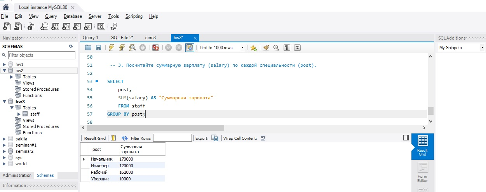

## Создание таблицы 

DROP DATABASE IF EXISTS hw3;\
CREATE DATABASE IF NOT EXISTS hw3;\
USE hw3;\
CREATE TABLE IF NOT EXISTS `staff`\
(\
	`id` INT AUTO_INCREMENT PRIMARY KEY,\
    `first_name` VARCHAR(45),\
    `last_name` VARCHAR(45),\
    `post` VARCHAR(45),\
    `seniority` INT,\
	`salary` INT,\
    `age` INT\
);\
TRUNCATE staff;\
INSERT `staff` (`first_name`, `last_name`,  `post`, `seniority`, `salary`,`age`)\
VALUES\
	 ('Вася', 'Петров', 'Начальник', 40, 100000, 60),\
	 ('Петр', 'Власов', 'Начальник', 8, 70000, 30),\
	 ('Катя', 'Катина', 'Инженер', 2, 70000, 25),\
	 ('Саша', 'Сасин', 'Инженер', 12, 50000, 35),\
	 ('Иван', 'Петров', 'Рабочий', 40, 30000, 59),\
	 ('Петр', 'Петров', 'Рабочий', 20, 55000, 60),\
	 ('Сидр', 'Сидоров', 'Рабочий', 10, 20000, 35),\
	 ('Антон', 'Антонов', 'Рабочий', 8, 19000, 28),\
	 ('Юрий', 'Юрков', 'Рабочий', 5, 15000, 25),\
	 ('Максим', 'Петров', 'Рабочий', 2, 11000, 19),\
	 ('Юрий', 'Петров', 'Рабочий', 3, 12000, 24),\
	 ('Людмила', 'Маркина', 'Уборщик', 10, 10000, 49);
     
SELECT * \
FROM `staff`;

## 1. Отсортируйте данные по полю заработная плата (salary) в порядке: убывания; возрастания.
 
SELECT id, first_name, last_name, post, seniority, salary, age\
FROM staff\
ORDER BY salary DESC;

SELECT id, first_name, last_name, post, seniority, salary, age\
FROM staff\
ORDER BY salary ASC;

 \

## 2. Выведите 5 максимальных заработных плат (saraly).

SELECT *\
FROM staff\
ORDER BY id\
LIMIT 5;

 
## 3. Посчитайте суммарную зарплату (salary) по каждой специальности (роst).
 
SELECT \
	post,\
	SUM(salary) AS "Суммарная зарплата"\
    FROM staff\
GROUP BY post;

## 4. Найдите кол-во сотрудников с специальностью (post) «Рабочий» в возрасте от 24 до 49 лет включительно.
 
 SELECT\
	post,\
COUNT(*) AS "Number of stuff"\
FROM staff\
WHERE post = "Рабочий" && age > 24 && age <= 49\
GROUP BY post;

## 5. Найдите количество специальностей.
 
SELECT  COUNT(distinct post) AS "Quantity of specialties"\
FROM staff;

## 6. Выведите специальности, у которых средний возраст сотрудников меньше 30 лет включительно.
 
SELECT \
	post, \
AVG(age)\
FROM staff\
GROUP BY post\
HAVING AVG(age) < 30;

 
 
 

 
